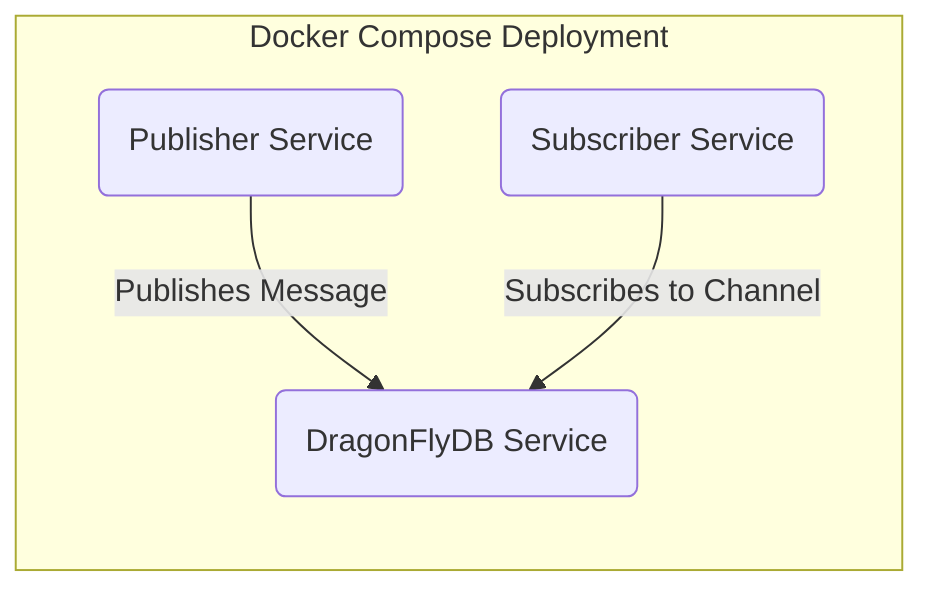
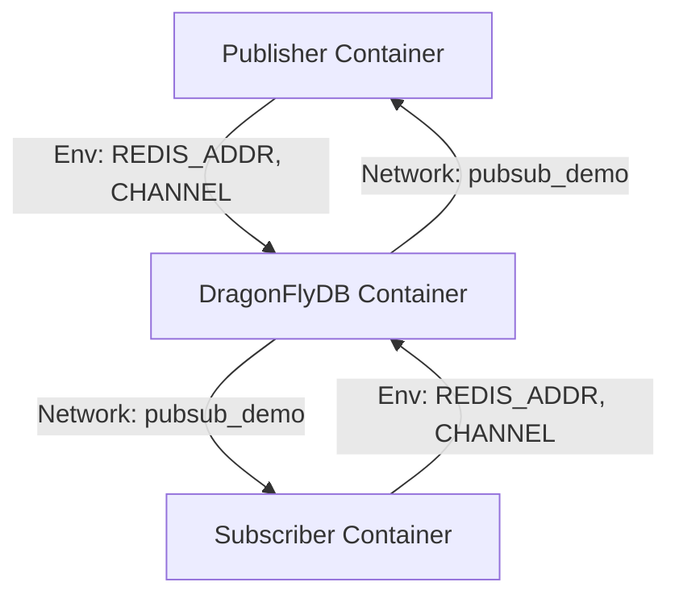
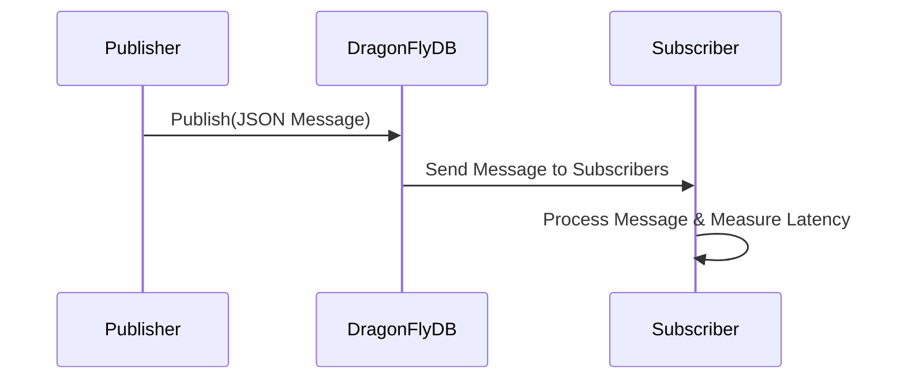
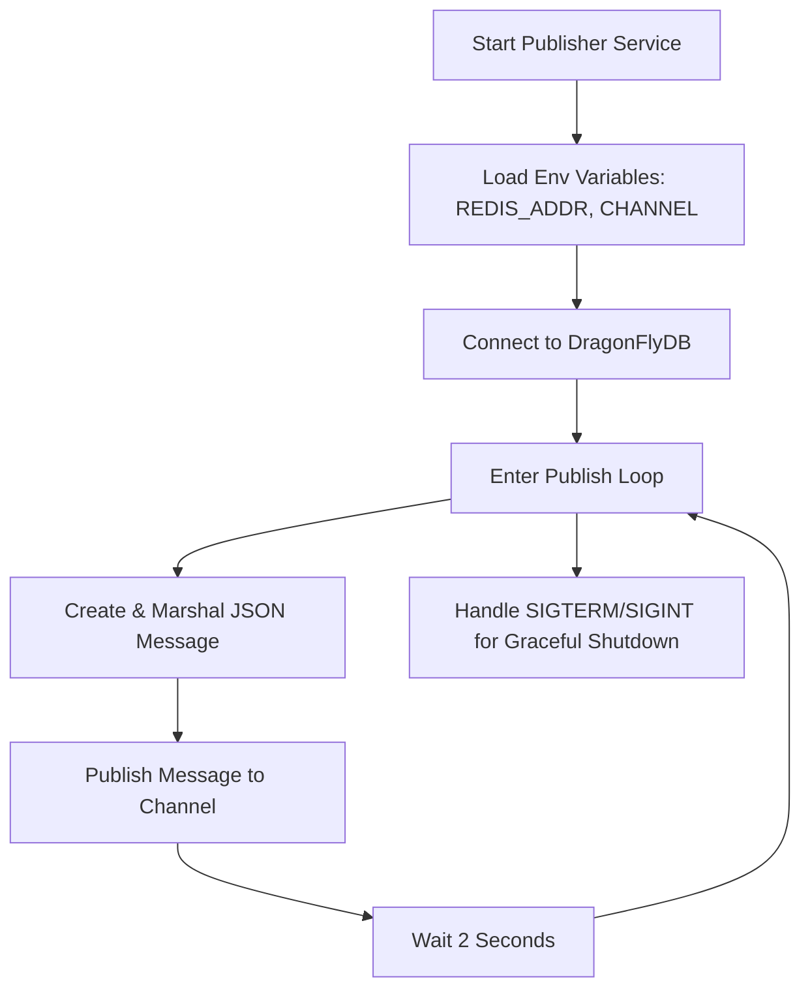
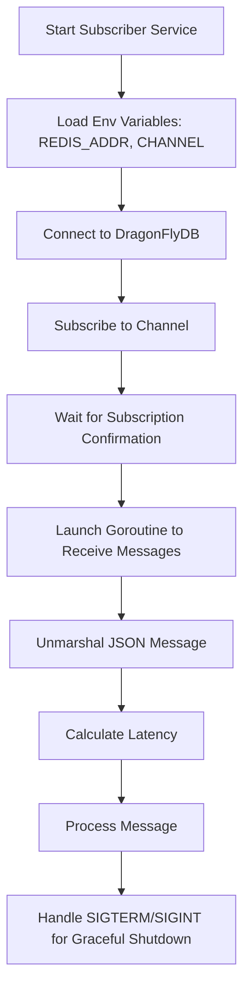

# Architecture Diagrams for Pub/Sub Demo with Golang and DragonFlyDB

This file contains Mermaid diagrams that represent the complete architecture of the demo. Each diagram focuses on a different aspect of the system.

---

## Overall System Architecture

This diagram shows the core services and their interactions.

---

## Docker Compose Architecture

This diagram illustrates how the containers are interconnected in the Docker Compose network.

---

## Message Flow

This sequence diagram shows the flow of a message from publication to consumption, including latency measurement.

---

## Publisher Internal Flow

This flowchart depicts the internal logic of the Publisher service.

---

## Subscriber Internal Flow

This flowchart shows the internal process of the Subscriber service.

---

These diagrams collectively provide a comprehensive view of the architecture—from container deployment with Docker Compose, through the message flow between the Publisher and Subscriber, to the inner workings of each service.