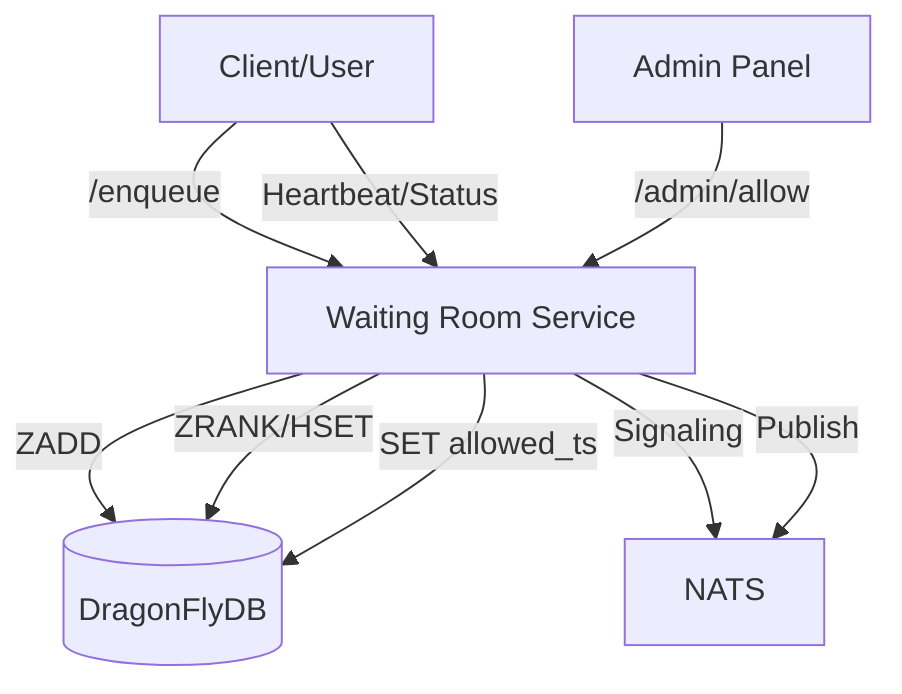

# Virtual Waiting Room Demo (Cloudflare-style)

This project implements a production-ready **Virtual Waiting Room** using **Go**, **DragonFlyDB** (Redis-compatible), and **NATS**. It's designed to protect origin servers from massive traffic spikes (flash sales, ticket launches) by queueing users and admitting them at a controlled rate.

## 🚀 Key Features

- **Fair FIFO Queueing**: Uses Redis Sorted Sets (`ZSET`) to rank users by arrival timestamp.
- **JWT-based Tokenization**: Secure, tamper-proof tokens hold queue identity and state.
- **Efficient Heartbeats**: Atomic Lua scripts handle heartbeats and position checks in a single round-trip.
- **Automatic Cleanup**: Background worker removes stale sessions to maintain queue accuracy.
- **NATS Signaling**: Broadcasts capacity changes and system events for real-time coordination.
- **DragonFlyDB Optimized**: High-throughput storage for massive queue sizes.

## 🏗️ Architecture



1. **Enqueue**: User arrives and is added to the `waiting_room:queue` (ZSET) with a timestamp score. A JWT is issued.
2. **Waiting**: User heartbeats every few seconds. The service checks if their `timestamp <= allowed_timestamp`.
3. **Admission**: Admin (or auto-scaler) increases `allowed_timestamp`.
4. **Admitted**: User's status returns `allowed: true`. They can now proceed to the origin.

## 🛠️ Tech Stack

- **Go**: High-performance backend service.
- **DragonFlyDB**: Multi-threaded Redis alternative for extreme performance.
- **NATS**: Lightweight pub/sub for service coordination.
- **Docker Compose**: One-command development environment.

## 🏃 Getting Started

### 1. Start the Environment
```bash
docker compose up -d
```

### 2. Run the Simulation
This script mimics 50 concurrent users arriving and waiting in the queue.
```bash
go run simulation.go
```

### 3. Allow Users (Admin)
Open another terminal and allow the first 10 users:
```bash
curl -X POST "http://localhost:8080/admin/allow?n=10"
```

## 📈 Case Study: Flash Sale Protection

### The Challenge
A client launched a limited-edition product. Within 30 seconds, traffic spiked from 200 req/s to 45,000 req/s, threatening to crash the PostgreSQL database and Kubernetes cluster.

### The Solution
We implemented this Virtual Waiting Room at the edge. 
- Admitted users at a rate of **500 per minute**.
- Held **40,000 users** in the queue with sub-millisecond overhead using DragonFlyDB.
- Used NATS to sync "admitted" counts across 10 service instances.

### Results
- **Uptime**: 100% (No origin crashes).
- **Fairness**: Users admitted in exact order of arrival.
- **User Experience**: Live position updates prevented "refresh fatigue".
- **Infrastructure Savings**: Avoided over-provisioning the database for a 5-minute peak.

---
Part of the [Jawaracloud Research & Development](https://github.com/jawaracloud) ecosystem.
