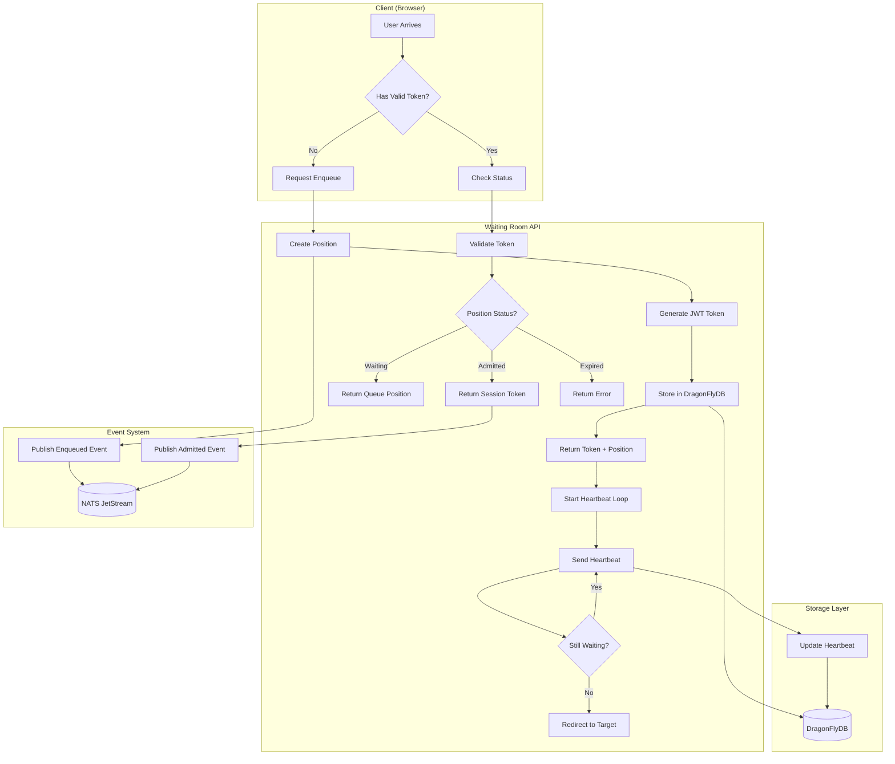
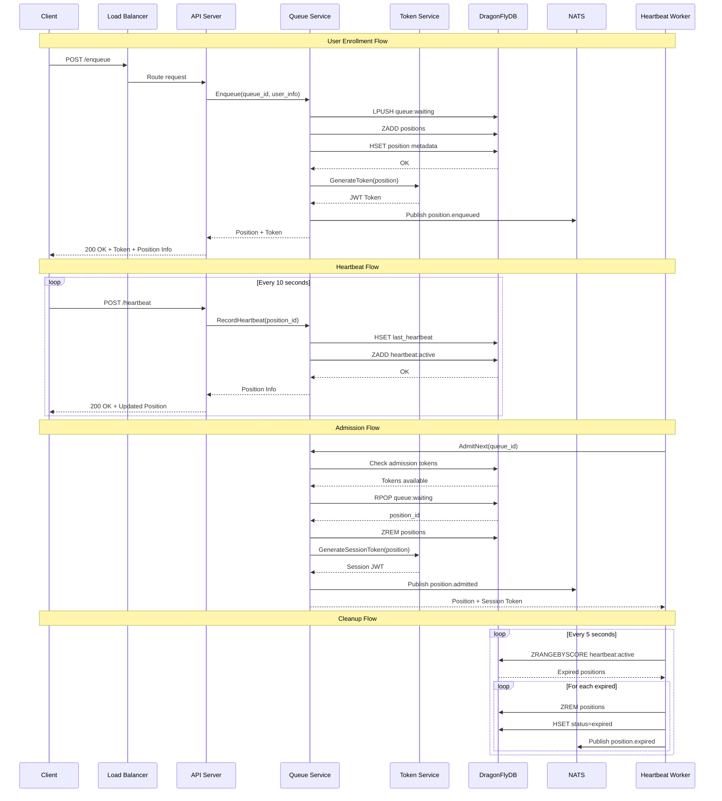
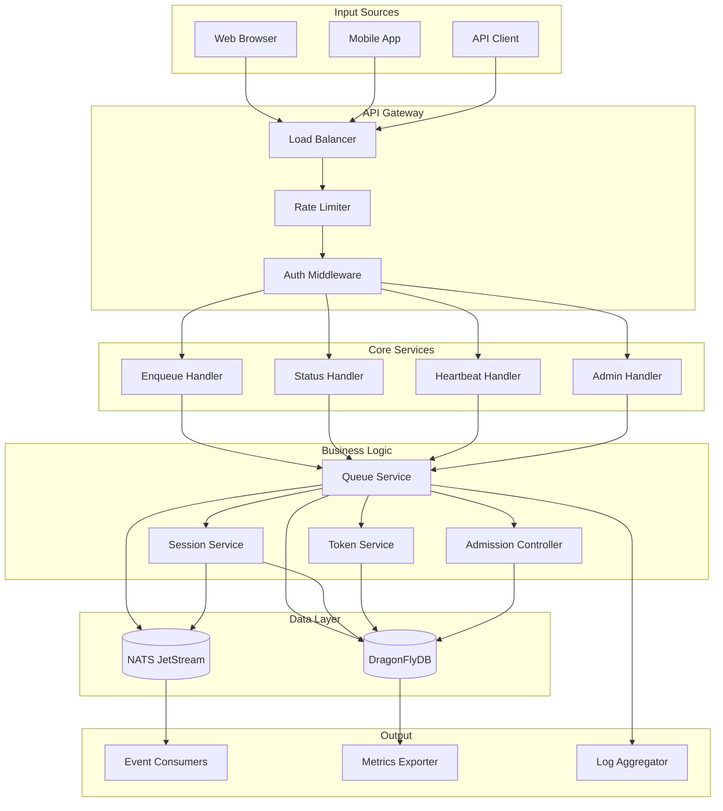
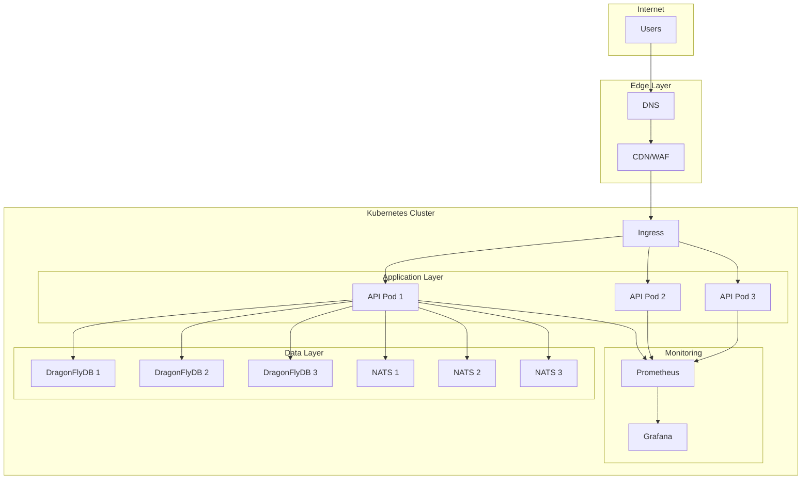

# Architecture Diagrams

## High-Level Architecture

### ASCII Diagram

```
                                    ┌─────────────────────────────────────────────────────────────┐
                                    │                        INTERNET                             │
                                    └─────────────────────────────────────────────────────────────┘
                                                              │
                                                              ▼
                                    ┌─────────────────────────────────────────────────────────────┐
                                    │                     LOAD BALANCER                           │
                                    │                   (nginx / cloud LB)                        │
                                    └─────────────────────────────────────────────────────────────┘
                                                              │
                         ┌────────────────────────────────────┼────────────────────────────────────┐
                         │                                    │                                    │
                         ▼                                    ▼                                    ▼
              ┌──────────────────────┐            ┌──────────────────────┐            ┌──────────────────────┐
              │                      │            │                      │            │                      │
              │    WAITING ROOM      │            │    WAITING ROOM      │            │    WAITING ROOM      │
              │      SERVER 1        │            │      SERVER 2        │            │      SERVER 3        │
              │                      │            │                      │            │                      │
              │  ┌────────────────┐  │            │  ┌────────────────┐  │            │  ┌────────────────┐  │
              │  │  HTTP Handler  │  │            │  │  HTTP Handler  │  │            │  │  HTTP Handler  │  │
              │  └───────┬────────┘  │            │  └───────┬────────┘  │            │  └───────┬────────┘  │
              │          │           │            │          │           │            │          │           │
              │  ┌───────▼────────┐  │            │  ┌───────▼────────┐  │            │  ┌───────▼────────┐  │
              │  │ Queue Service  │  │            │  │ Queue Service  │  │            │  │ Queue Service  │  │
              │  └───────┬────────┘  │            │  └───────┬────────┘  │            │  └───────┬────────┘  │
              │          │           │            │          │           │            │          │           │
              │  ┌───────▼────────┐  │            │  ┌───────▼────────┐  │            │  ┌───────▼────────┐  │
              │  │ Token Service  │  │            │  │ Token Service  │  │            │  │ Token Service  │  │
              │  └───────┬────────┘  │            │  └───────┬────────┘  │            │  └───────┬────────┘  │
              │          │           │            │          │           │            │          │           │
              │  ┌───────▼────────┐  │            │  ┌───────▼────────┐  │            │  ┌───────▼────────┐  │
              │  │ Heartbeat Svc  │  │            │  │ Heartbeat Svc  │  │            │  │ Heartbeat Svc  │  │
              │  └───────┬────────┘  │            │  └───────┬────────┘  │            │  └───────┬────────┘  │
              │          │           │            │          │           │            │          │           │
              └──────────┼───────────┘            └──────────┼───────────┘            └──────────┼───────────┘
                         │                                    │                                    │
                         └────────────────────────────────────┼────────────────────────────────────┘
                                                              │
                         ┌────────────────────────────────────┼────────────────────────────────────┐
                         │                                    │                                    │
                         ▼                                    ▼                                    ▼
              ┌──────────────────────┐            ┌──────────────────────┐            ┌──────────────────────┐
              │                      │            │                      │            │                      │
              │     DRAGONFLYDB      │            │        NATS          │            │     PROMETHEUS       │
              │    (Redis-compatible)│            │    (JetStream)       │            │     (Metrics)        │
              │                      │            │                      │            │                      │
              │  • Queue Lists       │            │  • Position Events   │            │  • Event counts      │
              │  • Position Hashes   │            │  • Session Events    │            │  • Latency histos    │
              │  • Session Data      │            │  • Queue Events      │            │  • Queue gauges      │
              │  • Heartbeat ZSET    │            │  • System Events     │            │  • Error rates       │
              │  • Rate Limiters     │            │  • DLQ               │            │                      │
              │                      │            │                      │            │                      │
              └──────────────────────┘            └──────────────────────┘            └──────────────────────┘
```

---

## User Flow Diagram

### Mermaid Flowchart



---

## Component Interaction Diagram

### Mermaid Sequence Diagram



---

## Data Flow Diagram

### Mermaid Graph



---

## Deployment Architecture

### Kubernetes Deployment

```yaml
# Simplified Kubernetes architecture
┌─────────────────────────────────────────────────────────────────────────────┐
│                              KUBERNETES CLUSTER                              │
├─────────────────────────────────────────────────────────────────────────────┤
│                                                                              │
│  ┌──────────────────────────────────────────────────────────────────────┐   │
│  │                           INGRESS CONTROLLER                          │   │
│  └──────────────────────────────────────────────────────────────────────┘   │
│                                      │                                       │
│  ┌───────────────────────────────────┼───────────────────────────────────┐  │
│  │                     WAITING ROOM NAMESPACE                            │  │
│  │                                                                       │  │
│  │   ┌─────────────────┐  ┌─────────────────┐  ┌─────────────────┐      │  │
│  │   │  API POD 1      │  │  API POD 2      │  │  API POD 3      │      │  │
│  │   │  - chi router   │  │  - chi router   │  │  - chi router   │      │  │
│  │   │  - queue svc    │  │  - queue svc    │  │  - queue svc    │      │  │
│  │   │  - token svc    │  │  - token svc    │  │  - token svc    │      │  │
│  │   └────────┬────────┘  └────────┬────────┘  └────────┬────────┘      │  │
│  │            │                    │                    │                │  │
│  │            └────────────────────┼────────────────────┘                │  │
│  │                                 │                                     │  │
│  │   ┌─────────────────────────────┼─────────────────────────────────┐   │  │
│  │   │                     SERVICES │                                 │   │  │
│  │   │   ┌─────────────────┐  ┌─────▼─────────┐  ┌─────────────────┐ │   │  │
│  │   │   │ waitingroom-api │  │ dragonflydb   │  │ nats            │ │   │  │
│  │   │   │ (ClusterIP)      │  │ (ClusterIP)   │  │ (ClusterIP)     │ │   │  │
│  │   │   └─────────────────┘  └───────────────┘  └─────────────────┘ │   │  │
│  │   └───────────────────────────────────────────────────────────────┘   │  │
│  │                                                                       │  │
│  │   ┌───────────────────────────────────────────────────────────────┐   │  │
│  │   │                    STATEFUL SETS                               │   │  │
│  │   │   ┌─────────────────┐  ┌─────────────────┐                    │   │  │
│  │   │   │ dragonflydb-0   │  │ nats-0          │                    │   │  │
│  │   │   │ dragonflydb-1   │  │ nats-1          │                    │   │  │
│  │   │   │ dragonflydb-2   │  │ nats-2          │                    │   │  │
│  │   │   └─────────────────┘  └─────────────────┘                    │   │  │
│  │   └───────────────────────────────────────────────────────────────┘   │  │
│  │                                                                       │  │
│  └───────────────────────────────────────────────────────────────────────┘  │
│                                                                              │
│  ┌──────────────────────────────────────────────────────────────────────┐   │
│  │                     MONITORING NAMESPACE                              │   │
│  │   ┌─────────────────┐  ┌─────────────────┐  ┌─────────────────┐      │   │
│  │   │ prometheus      │  │ grafana         │  │ alertmanager    │      │   │
│  │   └─────────────────┘  └─────────────────┘  └─────────────────┘      │   │
│  └──────────────────────────────────────────────────────────────────────┘   │
│                                                                              │
└─────────────────────────────────────────────────────────────────────────────┘
```

---

## Request Flow Diagram

### ASCII Request Flow

```
┌─────────────────────────────────────────────────────────────────────────────────────┐
│                              REQUEST PROCESSING FLOW                                 │
└─────────────────────────────────────────────────────────────────────────────────────┘

    REQUEST                MIDDLEWARE                 HANDLER                 SERVICE
    ───────                ──────────                 ───────                 ───────

    ┌─────────┐
    │ HTTP    │
    │ Request │
    └────┬────┘
         │
         ▼
    ┌─────────────────────────────────────────────────────────────────────────────────┐
    │  ┌─────────────┐    ┌─────────────┐    ┌─────────────┐    ┌─────────────┐       │
    │  │   Logging   │───▶│    CORS     │───▶│ Rate Limit  │───▶│  Recovery   │       │
    │  │  (request   │    │  (headers)  │    │  (sliding   │    │  (panic     │       │
    │  │   ID, time) │    │             │    │   window)   │    │  recovery)  │       │
    │  └─────────────┘    └─────────────┘    └─────────────┘    └─────────────┘       │
    └─────────────────────────────────────────────────────────────────────────────────┘
                                                                              │
         ┌────────────────────────────────────────────────────────────────────┘
         │
         ▼
    ┌─────────────────────────────────────────────────────────────────────────────────┐
    │  ┌─────────────┐    ┌─────────────┐    ┌─────────────┐    ┌─────────────┐       │
    │  │    Auth     │───▶│ Validation  │───▶│   Handler   │───▶│   Service   │       │
    │  │  (JWT check)│    │  (request   │    │  (business  │    │  (domain    │       │
    │  │             │    │   schema)   │    │   logic)    │    │   logic)    │       │
    │  └─────────────┘    └─────────────┘    └─────────────┘    └─────────────┘       │
    └─────────────────────────────────────────────────────────────────────────────────┘
                                                                              │
         ┌────────────────────────────────────────────────────────────────────┘
         │
         ▼
    ┌─────────────────────────────────────────────────────────────────────────────────┐
    │                              STORAGE LAYER                                        │
    │  ┌─────────────────────────────────┐    ┌─────────────────────────────────┐      │
    │  │         DragonFlyDB             │    │            NATS                 │      │
    │  │  ┌───────────┐ ┌───────────┐   │    │  ┌───────────┐ ┌───────────┐   │      │
    │  │  │   Queue   │ │  Session  │   │    │  │  Publish  │ │  Consume  │   │      │
    │  │  │   Store   │ │   Store   │   │    │  │  Events   │ │  Events   │   │      │
    │  │  └───────────┘ └───────────┘   │    │  └───────────┘ └───────────┘   │      │
    │  └─────────────────────────────────┘    └─────────────────────────────────┘      │
    └─────────────────────────────────────────────────────────────────────────────────┘
                                                                              │
         ┌────────────────────────────────────────────────────────────────────┘
         │
         ▼
    ┌─────────┐
    │ HTTP    │
    │ Response│
    └─────────┘
```

---

## Network Topology

### Mermaid Graph


